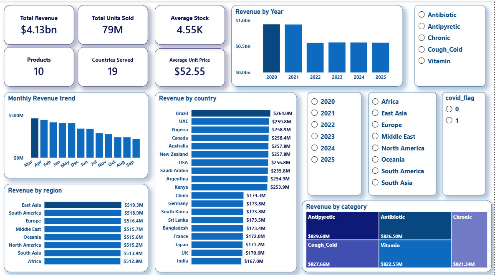
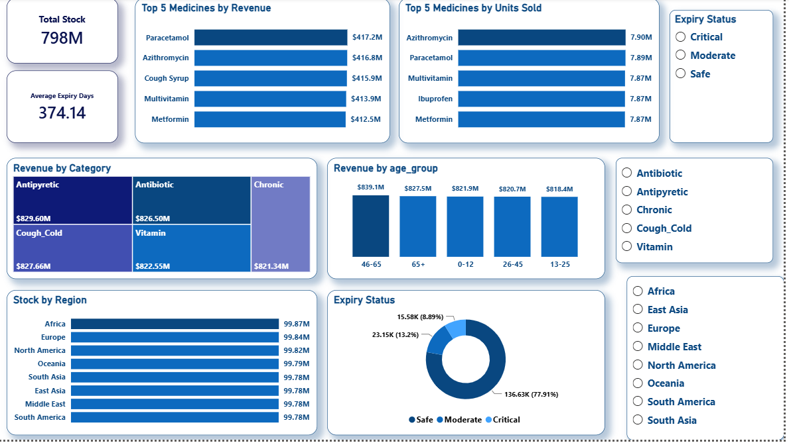

# 💊 MediCore Pharmacy Sales Analysis

### Business Intelligence Project | Excel • SQLite • Power BI


---

## 📑 Table of Contents

- [Project Overview](#-project-overview)
- [Business Problem](#-business-problem)
- [Project Objectives](#-project-objectives)
- [Dataset Overview](#-dataset-overview)
- [Tools Used](#-tools-used)
- [Project Workflow](#-project-workflow)
- [Repository Structure](#-repository-structure)
- [Dashboard Overview](#-dashboard-overview)
- [Key Findings](#-key-findings)
- [Recommendations](#-recommendations)
- [Project Files](#-project-files)
- [Author](#-author)

---

## 📌 Project Overview

This portfolio project analyses a **synthetic Global Pharmacy Sales dataset (2020–2025)** to demonstrate how Business Intelligence tools can be used to transform raw transactional data into actionable business insights.

Using **Microsoft Excel** for data cleaning, **DB Browser for SQLite** for SQL analysis, and **Microsoft Power BI** for data visualisation, the project explores sales performance, customer purchasing behaviour, inventory health, medicine demand, and regional performance.

The outcome is a set of interactive dashboards supported by SQL analysis, a detailed business report, and an executive presentation that demonstrate an end-to-end Business Intelligence workflow.

---

## 🎯 Business Problem

Pharmacies generate large volumes of sales and inventory data every day. However, raw transactional data alone does not provide the insights needed to support effective business decisions.

This project demonstrates how Business Intelligence techniques can be applied to answer important business questions, including:

- Which medicines generate the highest revenue?
- Which countries and regions contribute the most sales?
- Which customer age groups drive revenue?
- Are inventory levels sufficient to meet demand?
- Which medicines are approaching expiry?
- What opportunities exist to improve procurement and inventory management?

The objective is to convert raw data into meaningful insights that support data-driven decision-making.

---

## 🎯 Project Objectives

The primary objective of this project was to analyse pharmacy sales and inventory data and develop an interactive Business Intelligence solution that supports data-driven decision-making.

Specifically, the project aimed to:

- Analyse overall sales performance from 2020 to 2025.
- Identify the highest-performing medicine categories and products.
- Evaluate revenue across countries and regions.
- Examine customer purchasing behaviour by age group.
- Monitor inventory levels and identify low-stock medicines.
- Detect medicines approaching expiry.
- Develop interactive Power BI dashboards to communicate business insights.
- Provide actionable recommendations based on the analysis.

---

## 🗂️ Dataset Overview

**Dataset:** Global Pharmacy Sales Dataset (Synthetic)

**Analysis Period:** 2020–2025

The dataset contains daily pharmacy sales transactions and inventory records designed for Business Intelligence and data analytics practice.

### Data Fields

| Field | Description |
|--------|-------------|
| date | Transaction date |
| year | Sales year |
| month | Sales month |
| day | Day of the month |
| region | Sales region |
| country | Country where the sale occurred |
| category | Medicine category |
| medicine | Medicine name |
| age_group | Customer age group |
| units_sold | Quantity sold |
| unit_price | Price per unit |
| stock_level | Available inventory |
| expiry_days_remaining | Remaining days before expiry |
| covid_flag | Indicates whether the sale occurred during a COVID-19 period |

---

## 🛠️ Tools Used

| Tool | Purpose |
|------|---------|
| **Microsoft Excel** | Data cleaning, validation, and preprocessing |
| **DB Browser for SQLite** | SQL queries and business analysis |
| **Microsoft Power BI** | Data modelling, DAX measures, and dashboard development |

---

## 🔄 Project Workflow

```text
Raw Dataset
     │
     ▼
Data Cleaning (Excel)
     │
     ▼
SQL Analysis (DB Browser for SQLite)
     │
     ▼
Data Modelling (Power BI)
     │
     ▼
Interactive Dashboards
     │
     ▼
Business Insights & Recommendations
```

---

## 📂 Repository Structure

```text
medicore-pharmacy-sales-analysis
│
├── data
│   ├── medicore_pharmacy_raw.csv
│   └── medicore_pharmacy_cleaned.csv
│
├── images
│   ├── executive_overview.png
│   └── product_inventory_analysis.png
│
├── powerbi
│   └── medicore_pharmacy_dashboard.pbix
│
├── report
│   ├── medicore_pharmacy_sales_analytics_report.pdf
│   └── medicore_pharmacy_presentation.pdf
│
├── sql
│   └── medicore_pharmacy_analysis_queries.sql
│
└── README.md
```

---

## 📊 Dashboard Overview

The Power BI solution consists of two interactive dashboard pages designed to provide both executive-level insights and operational visibility into pharmacy sales and inventory performance.

### 1️⃣ Executive Overview

This dashboard provides a high-level summary of business performance, enabling stakeholders to monitor key metrics and sales trends.

**Key Features**

- KPI Cards
  - Total Revenue
  - Total Units Sold
  - Average Unit Price
- Revenue Trend (2020–2025)
- Revenue by Country
- Revenue by Region
- Revenue by Category
- Interactive Slicers (Year, Region, Category)



---

### 2️⃣ Product & Inventory Analysis

This dashboard focuses on product performance and inventory management, helping identify high-performing medicines and inventory risks.

**Key Features**

- Top 5 Medicines
- Revenue by Customer Age Group
- Inventory Levels by Region
- Medicines Nearing Expiry
- Expiry Status Analysis



---

## 🔍 Key Findings

The analysis uncovered several important business insights across sales performance, customer behaviour, and inventory management.

- 💰 **Generated approximately $4.13 billion in revenue** between 2020 and 2025, reflecting strong and consistent sales performance.
- 🌍 Revenue was distributed across multiple countries and regions, demonstrating a diversified market presence.
- 💊 A relatively small number of medicines generated a significant share of total revenue, indicating reliance on key products.
- 👥 Customers aged **46–65 years** contributed the highest revenue, highlighting them as the pharmacy's primary customer segment.
- 📦 Inventory levels were generally well managed, with most medicines maintaining healthy stock availability.
- ⏳ While most products remained within the safe expiry category, a small proportion required closer monitoring to minimise inventory losses.
- 📈 Interactive dashboards enabled faster identification of sales trends, inventory risks, and business opportunities compared to manual reporting.

---

## 💡 Recommendations

Based on the analysis, the following recommendations were proposed:

- Implement demand-driven procurement using historical sales trends.
- Prioritise inventory availability for high-performing medicines.
- Develop market-specific sales strategies for lower-performing countries.
- Strengthen inventory monitoring through proactive low-stock alerts.
- Apply the **First-Expiry, First-Out (FEFO)** inventory management approach to minimise product wastage.
- Expand customer engagement initiatives targeting younger age groups to diversify future revenue.
- Integrate Business Intelligence dashboards into routine business reporting to support data-driven decision-making.

---

## 📁 Project Files

This repository includes:

| File | Description |
|------|-------------|
| **Raw Dataset** | Original pharmacy sales dataset |
| **Cleaned Dataset** | Dataset prepared using Microsoft Excel |
| **SQL Queries** | Business analysis queries written in DB Browser for SQLite |
| **Power BI Dashboard** | Interactive dashboard developed in Microsoft Power BI |
| **Project Report** | Comprehensive business intelligence report |
| **Presentation** | Executive presentation summarising the project |

---

## 👩🏽‍💻 Author

**Blessing Ogomegbulam**

Data Analyst

Passionate about transforming data into actionable business insights through analytics and visualization.

- **LinkedIn:** *https://www.linkedin.com/in/blessingogomegbulam/*
- **GitHub:** *https://github.com/Mandyamaka*

---

## 🚀 Skills Demonstrated

- Data Cleaning and Validation
- SQL Querying
- Business Intelligence
- Data Modelling
- Dashboard Development
- Data Visualization
- KPI Design
- Inventory Analysis
- Sales Performance Analysis
- Business Reporting
- Business Recommendations
